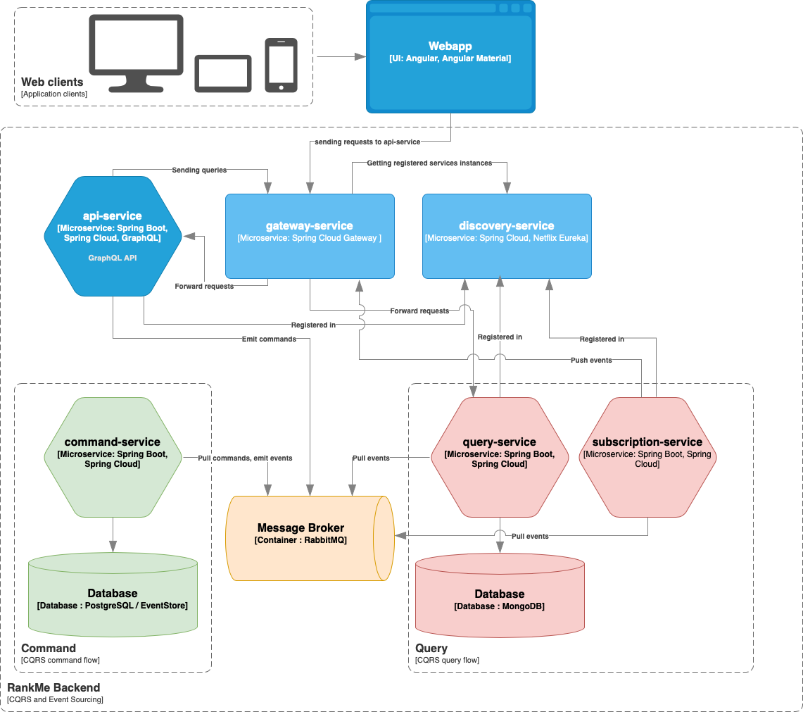

# RankMe
Application to manage users ranking based on Glicko rating system.
## Architecture
System is designed using **Command Query Responsibility Segregation** (CQRS) and **Event Sourcing** patterns.
Frontend is **Single Page Application** (SPA) implemented in Angular Framework.
Backend application contains multiple microservices that are standard Spring Boot applications.

Backend services might be divided into two types:

### Infrastructure services
- **config-service** - service that contains and propagate configuration for other services.
- **discovery-service** - services registry.
- **gateway-service** - service for handling and distributing HTTP traffic.

### Functional services
- **api-service** - service that contains GraphQL API and orchestrate CQRS commands and queries.
- **command-service** - service for handling CQRS commands.
- **query-service** - service for handling CQRS queries.

### Diagram

## Application start
Requirements:
- Gradle 7
- Java 11
- Angular CLI 12
- Docker, Docker Compose

To start the whole system it needs to run both **backend** and **frontend** parts.

### Backend
- Go to *project root* directory
- Build application using Gradle `gradle clean build`
- Run `docker-compose up`

Services:
- http://localhost:9010 - Config service
- http://localhost:9020 - Gateway service
- http://localhost:9030 - Eureka Discovery Service
- http://localhost:9040/graphiql - GraphQL API
- http://localhost:9050 - Command service
- http://localhost:9060 - QueryService
___
All services might be also run separately without Docker as standard Spring Boot Application. They require running *RabbitMQ*, *MongoDB* and *PostgreSQL/Event Store* instances.
### Frontend
- Go to *webapp* directory
- Install NPM dependencies using `npm install`
- Run `ng serve`

Application is available under http://localhost:4200